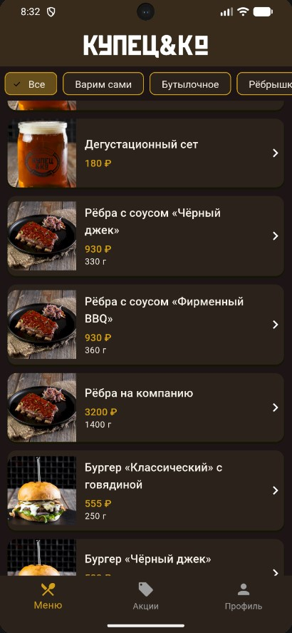
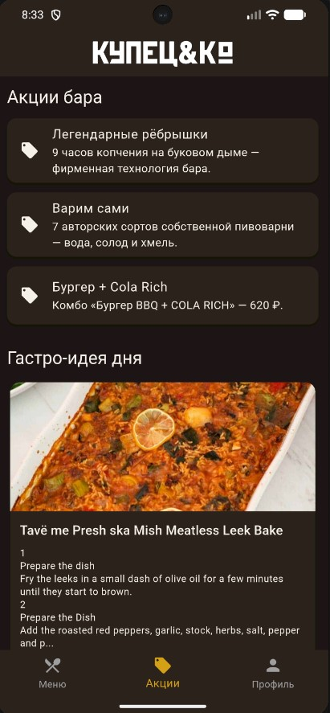
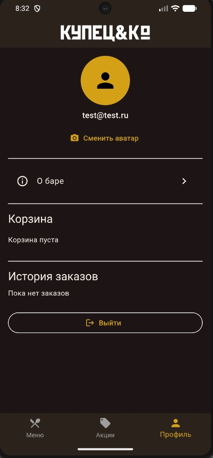

**Автор:** Климатов Павел  
**Учебное заведение:** IT Hub College  
**Группа:** 3ЭИТ-9.23

# Купец&Ко

Мобильное приложение пивного бара «Купец&Ко» — пр. Мира, 86, Красноярск.

Итоговая работа по дисциплине **Flutter** (IThub).

## Описание

Приложение для просмотра меню бара, акций и оформления заказа. Есть авторизация, корзина с историей, профиль с аватаром и экран с информацией о заведении.

**Основные экраны:**
- вход и регистрация;
- меню с фильтром по категориям;
- акции бара и случайное блюдо с TheMealDB;
- профиль: аватар, корзина, история заказов;
- карточка позиции меню;
- «О баре» — контакты, соцсети, карта, статья из Wikipedia.

Нижняя панель: **Меню · Акции · Профиль**.

## Скриншоты

| Меню | Акции | Профиль |
|:----:|:-----:|:-------:|
|  |  |  |

## Технологии

| Компонент | Решение |
|-----------|---------|
| UI | Flutter, Material Design |
| Архитектура | MVVM + Provider |
| Навигация | go_router |
| Локальное хранение | Hive |
| Сеть | http (TheMealDB, Wikipedia) |
| Авторизация | Hive (локально) / Firebase Auth |
| Прочее | image_picker, url_launcher, flutter_launcher_icons |

## Запуск

Требования: Flutter SDK 3.12+, Android SDK (для эмулятора или телефона).

```bash
git clone https://github.com/klimatov/kupets_app
cd kupets_app
flutter pub get
flutter run
```

Android-эмулятор:

```bash
flutter emulators --launch Pixel_7_Pro
flutter run -d emulator-5554
```

Web:

```bash
flutter run -d chrome
```

Иконки приложения (после клонирования, при необходимости):

```bash
dart run flutter_launcher_icons
```

## Структура `lib/`

```
lib/
├── core/           # тема, константы
├── data/           # модели, источники данных, репозитории
├── presentation/   # экраны, viewmodel, виджеты, роутер
├── app.dart        # DI и провайдеры
└── main.dart
```

Данные меню лежат в `assets/data/menu.json`, изображения — в `assets/images/`.

## Авторизация

Сейчас используется локальная авторизация через Hive — для входа достаточно email и пароля (от 6 символов). Реализован также класс `FirebaseAuthRepository`; для подключения Firebase нужно выполнить `flutterfire configure` и добавить `google-services.json`.

## Использованные виджеты

`Scaffold`, `AppBar`, `BottomNavigationBar`, `Card`, `ListTile`, `ElevatedButton`, `Chip`, `CircleAvatar`, `SnackBar`, `AlertDialog`, `showModalBottomSheet`.

## Сборка

```bash
flutter build apk        # Android
flutter build web        # Web
```

На Windows для некоторых сборок может понадобиться режим разработчика (symlink support).

